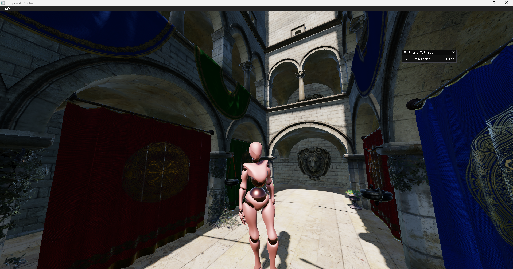

# graphics_engine

Little PBR engine (used to be called OPENGL_PROFILING)

## -- Features --
- PBR rendering
- Deferred rendering
- HDR postprocessing
- Cacade shadow maps for directional lights
- Omnidirectional point shadows
- Skeletal animation + animation blending
- Controller support

## -- Potential Features --
- Signed distance functions for static objects, to allow:
    - Ray marched soft shadows
    - Ambient occlusion
    - Global illumination (?)
- Screen space reflections
- Parallax corrected cubemaps
- A better asset management system (multithreading?)
- Rewrite the whole thing in Vulkan
